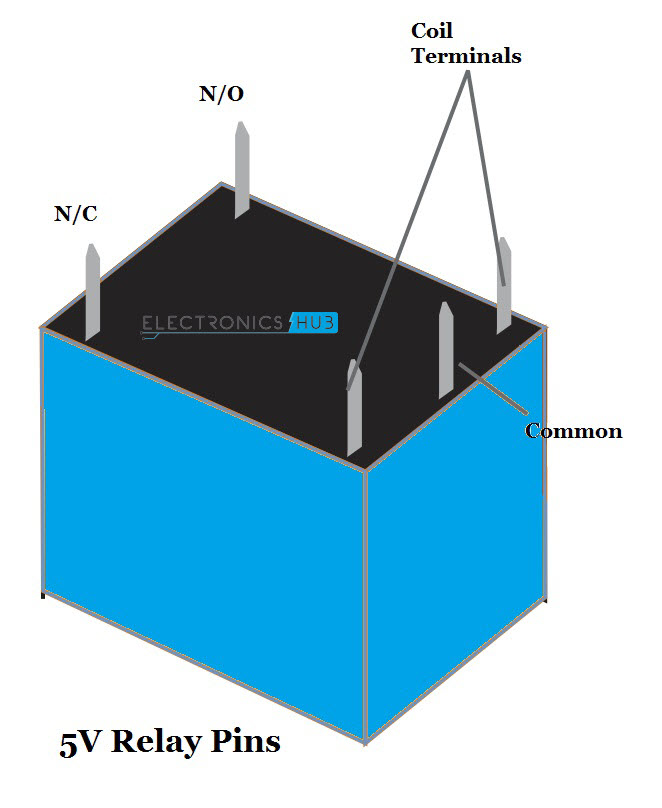
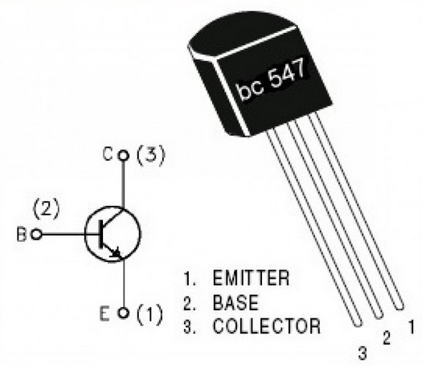
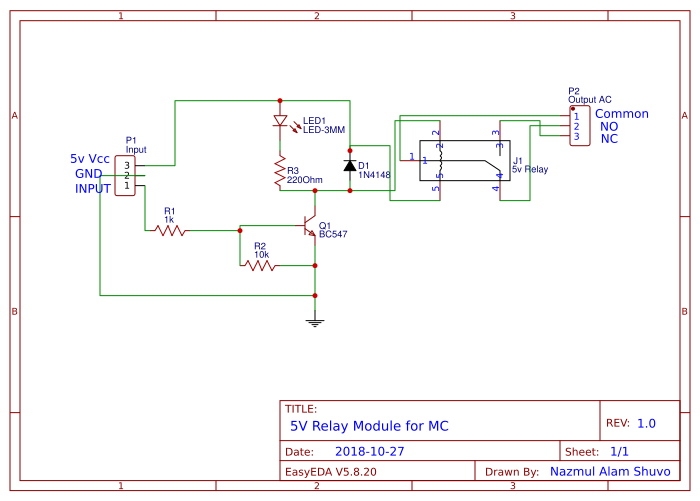
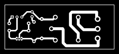
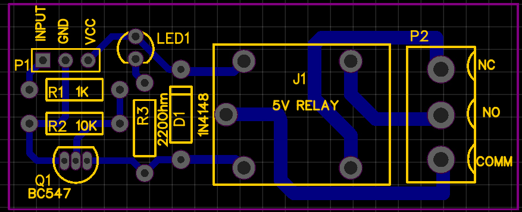
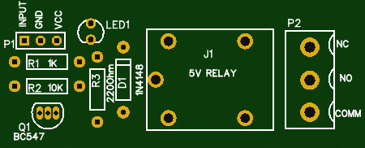

# 5V-Relay-Module-for-MC
5V Relay Module for MC. It has been tested circuit. 

## Pinout Relay & BC547:

## Circuit Diagram:

## PCB Layout:

## HappY Electronics :D
 :+1:

## LINK::
https://easyeda.com/nazmul.shuvo2/working-5v-relay-module-for-mc
